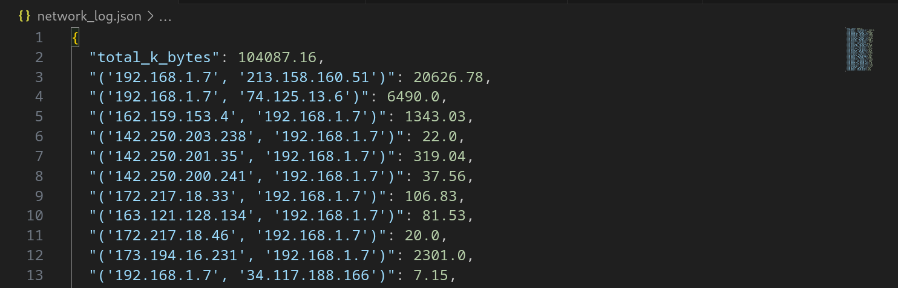

## 📥 Capture Network Traffic
Used `tcpdump`, as it's more handy in servers where tools like `wireshark` won't be an option.
```bash
sudo tcpdump -i wlp8s0 -w capture.pcap -v
```

<br/>

## 📊 Analyze Bandwidth Usage
Used `tshark` as it makes analyzing the traffic captured easier, while capturing this traffic I was playing a you-tube video, that's why we see the frames and bytes majority (`frames:5893 bytes:7038173`) (around `7 Mbytes`) is from `udp` and `quic` which is you-tube quick implementation of `udp`
```bash
tshark -r capture.pcap -qz io,phs

===================================================================
Protocol Hierarchy Statistics
Filter: 

eth                                      frames:6393 bytes:7307515
  ip                                     frames:6389 bytes:7307347
    udp                                  frames:5967 bytes:7047347
      dns                                frames:74 bytes:9174
      quic                               frames:5893 bytes:7038173
        quic                             frames:55 bytes:48900
          quic                           frames:19 bytes:26581
    tcp                                  frames:422 bytes:260000
      tls                                frames:209 bytes:240182
        tcp.segments                     frames:54 bytes:138985
          tls                            frames:45 bytes:124735
  arp                                    frames:4 bytes:168
===================================================================
```

```python
quic   frames:5893 bytes:7038173  # YouTube using QUIC over UDP (~7MB)
udp    frames:5967 bytes:7047347
tcp    frames:422  bytes:260000
```

#### 🔍 We can also break usage down into time intervals:
Analyze the usage with chunks of time, here we chosen 10 seconds, and surly enough if we add up the bytes below (around `7 Mbytes`) we will get the same result as above.
```bash
tshark -r capture.pcap -q -z io,stat,10

===============================
| IO Statistics               |
|                             |
| Duration: 40.493846 secs    |
| Interval: 10 secs           |
|                             |
| Col 1: Frames and bytes     |
|-----------------------------|
|          |1                 |
| Interval | Frames |  Bytes  |
|-----------------------------|
|  0 <> 10 |   1051 |  929332 |
| 10 <> 20 |   2696 | 3307638 |
| 20 <> 30 |   1527 | 1690195 |
| 30 <> 40 |   1114 | 1379957 |
| 40 <> Dur|      5 |     393 |
===============================
```

<br/>

## 📌 Identify High Data Usage Apps
Now lets find bandwidth usage for each app/ip. 
```bash
tshark -r capture.pcap -q -z conv,udp
================================================================================
UDP Conversations
Filter:<No Filter>
                                                           |       <-      | |       ->      | |     Total     |    Relative    |   Duration   |
                                                           | Frames  Bytes | | Frames  Bytes | | Frames  Bytes |      Start     |              |
192.168.1.7:57235          <-> 213.158.160.48:443            2335 3,222 kB      196 37 kB        2531 3,259 kB     19.717597000        17.7925
192.168.1.7:38853          <-> 213.158.160.44:443            1729 2,404 kB      150 18 kB        1879 2,422 kB     15.041172000         2.2948
192.168.1.7:51726          <-> 142.250.203.246:443            540 719 kB         79 12 kB         619 731 kB        0.014505000        22.1784
192.168.1.7:43169          <-> 142.251.37.174:443             333 237 kB        224 187 kB        557 425 kB        4.553617000        34.9540
192.168.1.7:54107          <-> 172.217.18.33:443               44 45 kB          15 5,890 bytes      59 51 kB         7.893045000        14.2435
192.168.1.7:37843          <-> 142.250.200.206:443             32 22 kB          17 13 kB          49 36 kB        20.104107000         1.6062
192.168.1.7:58423          <-> 142.250.201.35:443              18 7,900 bytes      18 4,140 bytes      36 12 kB         7.285366000        14.7700
192.168.1.7:39123          <-> 142.250.203.238:443             17 12 kB           8 4,118 bytes      25 16 kB        22.119448000         0.4696
192.168.1.7:49956          <-> 142.250.200.241:443             12 9,045 bytes       9 2,977 bytes      21 12 kB         9.047717000         0.3690
192.168.1.7:56659          <-> 172.217.21.22:443               15 14 kB           5 2,122 bytes      20 16 kB        21.588508000         0.2111
192.168.1.7:57259          <-> 213.158.160.48:443               9 6,032 bytes       9 2,328 bytes      18 8,360 bytes    26.593560000         0.1273
192.168.1.7:58902          <-> 216.58.211.202:443               9 3,932 bytes       9 6,340 bytes      18 10 kB        37.217590000         0.2794
192.168.1.7:34544          <-> 216.58.198.78:443               10 4,968 bytes       7 5,454 bytes      17 10 kB         8.772542000         0.2743
192.168.1.7:58117          <-> 142.250.203.230:443             10 7,334 bytes       7 2,267 bytes      17 9,601 bytes     8.956815000         0.2741
192.168.1.7:34261          <-> 172.217.18.234:443               8 7,184 bytes       8 2,090 bytes      16 9,274 bytes     7.945876000         0.1858
192.168.1.7:39125          <-> 142.250.200.195:443              6 3,264 bytes       5 2,029 bytes      11 5,293 bytes     7.144726000         1.6597
192.168.1.7:49541          <-> 163.121.128.134:53               2 510 bytes       2 142 bytes       4 652 bytes     0.000000000         0.0121
```
- YouTube traffic (`QUIC` over `UDP` on port `443`) is consuming the most bandwidth

And surly enough if we add the bytes usage for you-tube ips, we get the same number (around `7 Mbytes`) discussed before.


<br/>

## Data Plan Enforcement
We saw above that the most bandwidth usage is by you-tube, if we wanna limit or cap its usage
```bash
sudo iptables -A OUTPUT -d 142.250.0.0/16 -j DROP && \
sudo iptables -A OUTPUT -d 172.217.0.0/16 -j DROP && \
sudo iptables -A OUTPUT -p udp --dport 443 -j DROP
```


# Automate Capturing & Analyzing Network Traffic With Bash and Python
`network_monitor.py` is a python script which takes the output `capture.pcap` from the `tcpdump` command 
```bash
sudo tcpdump -i wlp8s0 -w capture.pcap -v
```
and calculates the bandwidth usage for each `IP` and the total too, then outputs this information in a json file `network_log.json`

But here we need to modify the `tcpdump` command, with an interval of for example 10 minutes to process this interval captured traffic chunk with python, then take another 10 seconds interval and so on...

```bash
tcpdump -i $INTERFACE -w capture.pcap -G "$TIME" -W 1 -v
```
Where `$TIME` is a variable and defined at the top of the bash script in seconds, it's defaulted to be 10 seconds.

The general flow 
```bash
while true; do
	capture_traffic
	tshark_analyze_traffic
	python_analyze_traffic_by_ip
done
```

### Python `IPs` bandwidth usage
```python
"source_ip", "destination_ip": total_k_bytes_usage_for_ip (in KB),
.
.
.
total_k_bytes (in KB) <-- total bandwidth for all ips
```
And those `total_k_bytes_usage_for_ip`, `total_k_bytes` are accumulated, each time the logic adds up to the previously saved total.

```json
{
"('192.168.1.7', '213.158.160.51')": 20626.78,
"('142.250.203.238', '192.168.1.7')": 22.0,
"('142.250.201.35', '192.168.1.7')": 319.04,
"('142.250.200.241', '192.168.1.7')": 37.56,
"('172.217.18.33', '192.168.1.7')": 106.83,
"('163.121.128.134', '192.168.1.7')": 81.53,
"('172.217.18.46', '192.168.1.7')": 20.0,
"('173.194.16.231', '192.168.1.7')": 2301.0,
"('192.168.1.7', '34.117.188.166')": 7.15,
"('192.168.1.7', '224.0.0.251')": 0.18,
"('172.217.18.234', '192.168.1.7')": 61.13,
"('172.217.171.202', '192.168.1.7')": 35.0,
"('192.168.1.7', '74.125.71.84')": 50.74,
"('142.251.37.225', '192.168.1.7')": 40.52,
"('192.168.1.7', '216.58.198.78')": 78.72,
"('142.251.116.94', '192.168.1.7')": 26.84,
"('172.217.18.34', '192.168.1.7')": 18.36,
"('142.250.203.234', '192.168.1.7')": 55.07,
"('172.67.70.44', '192.168.1.7')": 835.0,
"('108.159.102.36', '192.168.1.7')": 227.0,
"('192.168.1.7', '199.232.81.229')": 6.17,
"('162.159.153.4', '192.168.1.7')": 1343.03,
"('162.159.152.4', '192.168.1.7')": 34.99,
"('142.250.200.195', '192.168.1.7')": 23.53,
"('192.168.1.7', '213.158.189.12')": 403.0,
"('192.168.1.7', '213.158.189.14')": 8.48,
"('142.250.203.227', '192.168.1.7')": 3.83,
"('192.168.1.7', '74.125.13.6')": 6490.0,
"('192.168.1.2', '239.255.255.250')": 0.32,
"('142.250.200.238', '192.168.1.7')": 12.98,
"('142.250.200.202', '192.168.1.7')": 9.01,
"('104.26.13.250', '192.168.1.7')": 8.42,
"('192.168.1.7', '196.10.52.57')": 0.18,
"('192.168.1.7', '34.107.141.31')": 8.72,
"total_k_bytes": 104087.16
}
```

Here for example I was manly watching a you-tube video and making some google searches, that's why we find google's ips here.

### To run the code
```bash
chmod +x network_monitor.sh
sudo ./network_monitor.sh
```

Don't forget to update the `network interface` in the top of the bash script
```bash
#!/bin/bash

# Configurable Variables
INTERFACE="wlp8s0" # Change this to your actual network interface
TIME=10 # Alert threshold in MB
```